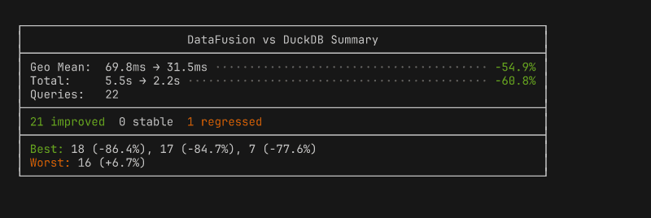
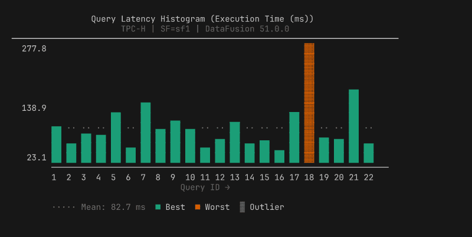
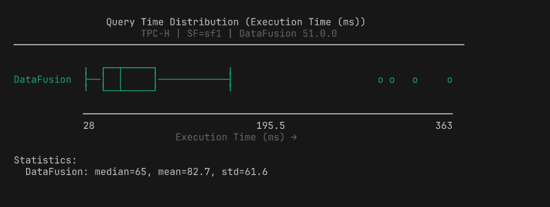
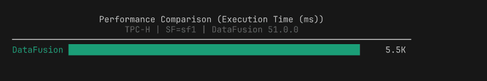
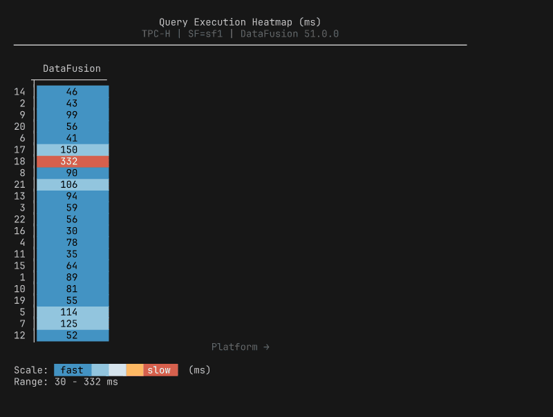
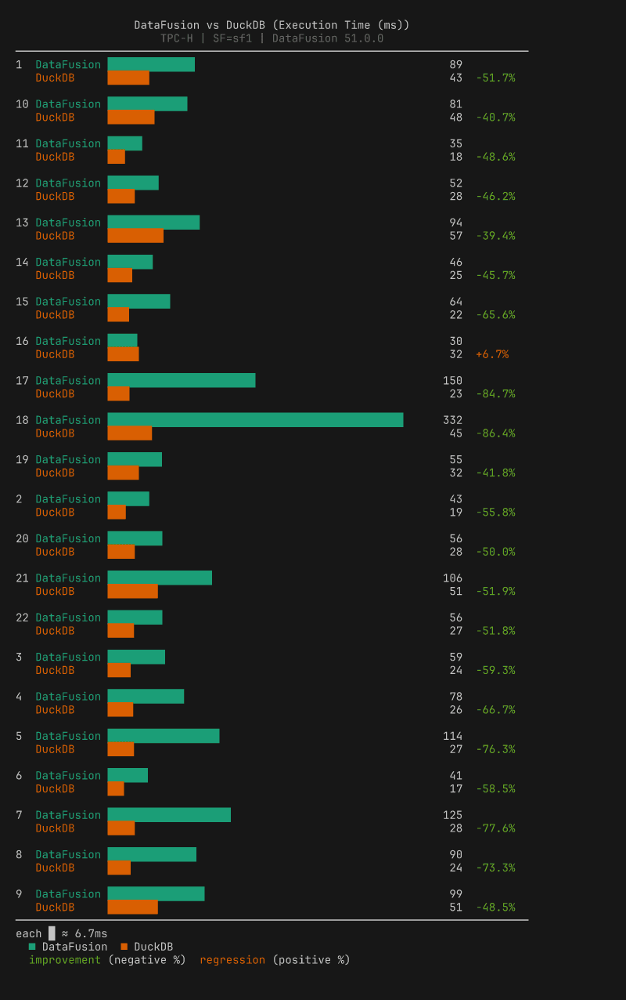
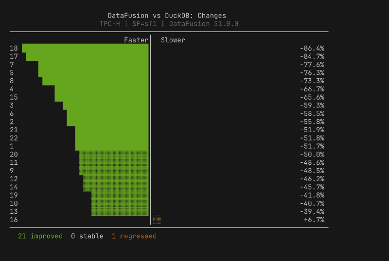
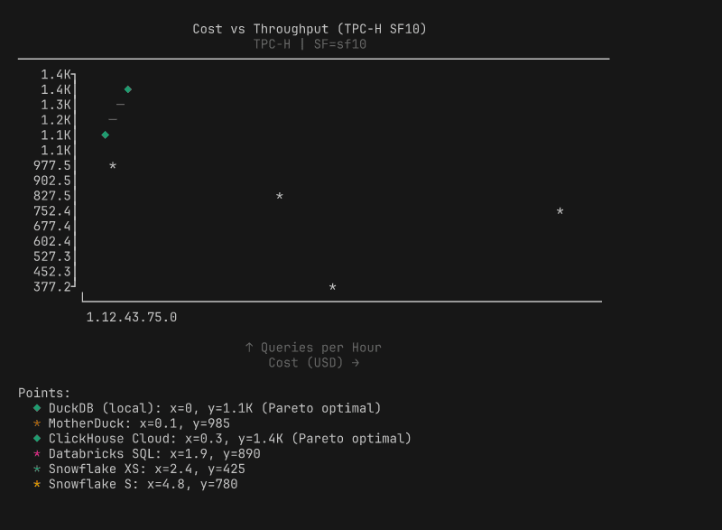
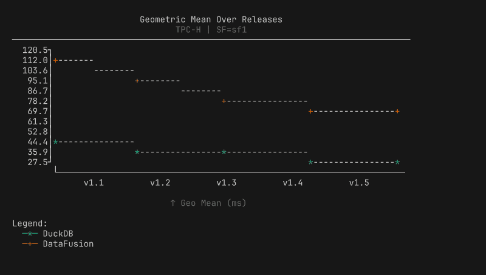

# Why we deleted Plotly and wrote our own ASCII charts

> Benchmark charts should arrive where you're already working, not in a file you have to go find.

**TL;DR**: BenchBox users work in terminals and coding agents, contexts where HTML files and browser windows break the flow. In v0.1.2, we built 3,365 lines of zero-dependency ASCII charting that renders inline everywhere: terminals, CI (continuous integration) logs, and LLM (large language model) tool responses. Along the way, we evaluated 10+ terminal libraries and removed 4,300 lines of Plotly.

---

## Where benchmark charts actually get read

BenchBox users work in text-based contexts: the terminal, MCP (Model Context Protocol) coding agents, and CI logs. None of them can render an HTML file.

BenchBox started with Plotly for visualization, a natural starting point: mature library, beautiful output, wide adoption. We built it thoroughly, too, with six chart types, a custom theme system, and export to HTML, PNG, SVG, and PDF via Plotly 5.24 and kaleido. But when we added MCP integration (BenchBox's server for LLM tool use), it became clear that charts needed to render where users already were, not in a separate browser window.

When an LLM called `generate_chart()`, the tool returned a file path:

```json
{
  "status": "generated",
  "format": "html",
  "file_path": "benchmark_runs/charts/performance_bar_20260213.html"
}
```

An LLM in a terminal conversation needs the chart content inline. It can't render HTML. With a file path, it would need a second tool call just to read the file, and even then it would be parsing raw HTML markup instead of seeing a chart.

The ASCII charting path returned something different:

```json
{
  "status": "generated",
  "format": "ascii",
  "content": "┌──────────────────────────────────────┐\n│ DuckDB ████████████████████  264ms   │\n└──────────────────────────────────────┘"
}
```

One tool call returns the chart inline, so both the LLM and the user see it immediately.

That contrast is what crystallized the decision. Every real usage pattern we had was text-based: the CLI printed to terminals, the MCP server responded to LLMs, and CI pipelines wrote to log files. Inline ASCII content served all three; HTML files served none.

---

## The dependency tax

Committing to inline ASCII also meant we could simplify. The Plotly pipeline carried real maintenance costs.

**Install weight**: Plotly is approximately 43 MB. Its dataframe compatibility layer (narwhals) adds another 3.3 MB. Total: around 46 MB of optional dependencies for an output format that didn't match our users' workflow. The ASCII implementation adds zero bytes of external dependencies.

**The dual data model**: Every chart type existed in two parallel hierarchies with a conversion layer in `exporters.py` translating between them:

| Plotly Model         | ASCII Model   | Chart Type   |
| -------------------- | ------------- | ------------ |
| BarDatum             | BarData       | Bar chart    |
| TimeSeriesPoint      | LinePoint     | Line chart   |
| CostPerformancePoint | ScatterPoint  | Scatter plot |
| DistributionSeries   | BoxPlotSeries | Box plot     |
| QueryLatencyDatum    | HistogramBar  | Histogram    |

Adding a new chart type meant implementing it in both systems, writing two sets of data models, building the conversion logic, and maintaining two sets of tests. This is the complexity that makes contributors hesitate before submitting a pull request.

**Maintenance surface area**: The Plotly-specific code, including source, tests, examples, and tooling, totaled approximately 3,000 lines. The removal commit touched 42 files and deleted 12 entirely. Plotly is excellent for dashboards, notebooks, and web applications, contexts where users have browsers and expect interactive visualizations. For a CLI tool, those maintenance costs need to earn their place against how users actually consume the output.

---

## Why not an existing terminal charting library?

Our first instinct was to find an off-the-shelf replacement. We evaluated over ten terminal charting libraries for Python, scored against five requirements:

1. **`render() -> str`**: Charts must return a string, not print to stdout. BenchBox's MCP server serializes tool responses as JSON, our test suite asserts on chart output, and charts get embedded in larger reports. Anything that prints directly to stdout breaks all three.

2. **Benchmark-specific annotations**: Best/worst query markers, percentage change labels, Pareto frontier lines, and regression highlighting. These are not generic charting features.

3. **Sub-character bar precision**: Unicode block elements at 1/8 character increments (`▏▎▍▌▋▊▉█`, nine levels). This matters when you have 22 queries to compare in a fixed-width terminal.

4. **4-tier terminal color degradation**: Truecolor (24-bit) degrading gracefully to 256-color, then 16-color, then no color. The NO_COLOR environment variable ([no-color.org](https://no-color.org/)) should be respected.

5. **Zero additional dependencies**: A benchmarking framework that adds numpy as a transitive dependency for charting undermines its own credibility as a lightweight tool.

We scored them:

| Library        |  render->str  | Precision | Color Degradation |  Deps   | Score |
| -------------- | :-----------: | :-------: | :---------------: | :-----: | :---: |
| plotext-plus   | Needs wrapper |   Good    |       Basic       |  numpy  | 7/10  |
| plotille       |      Yes      |    Low    |     256 only      |    0    | 4/10  |
| termgraph      |  No (stdout)  |    Low    |       Basic       |    0    | 3/10  |
| uniplot        |  No (stdout)  |  Medium   |       Basic       |  numpy  | 3/10  |
| rich           |      N/A      |    N/A    |       Good        |  rich   | 2/10  |
| asciichartpy   |      Yes      |    Low    |       None        |    0    | 2/10  |
| drawille       |      Yes      |  Braille  |       None        |    0    | 2/10  |
| bashplotlib    |      No       |    Low    |       None        |    0    | ≤2/10 |
| textual        |      N/A      |    N/A    |       Good        | textual | ≤2/10 |
| plotext (base) |      No       |   Good    |       Basic       |    0    | ≤2/10 |

The closest candidate was plotext-plus at 7/10, but it prints to stdout (requiring capture wrappers for MCP responses), has no benchmark-specific annotations, and brings numpy as a dependency. When the highest-scoring library still needs significant wrapping to meet our core requirements, custom implementation is the most viable choice.

---

## What we built: 9 chart types, zero dependencies

The ASCII charting module is 3,365 lines of Python across 11 files, with zero external dependencies. The architecture starts with a base class (`ASCIIChartBase`, 494 lines) that handles terminal capability detection, the 4-tier color system, and Unicode-to-ASCII fallback. Every chart type inherits from this base and implements a single method: `render() -> str`.

The screenshots below use illustrative data to show each chart type with ANSI colors. Every chart renders inline in the terminal and degrades gracefully to plain text when piped.

**Summary box**: aggregate stats, environment info, best/worst queries at a glance.



**Query histogram**: per-query vertical bars with best/worst highlighting, auto-splits into two panels at 33 queries.



**Box plot**: distribution with quartiles, whiskers, and outlier markers.



**Performance bar**: total execution time per platform with 1/8 block precision.



**Heatmap**: per-query timing across platforms, color-scaled from fast to slow.



**Comparison bar**: paired bars per query with percentage change labels (requires two result files).



**Diverging bar**: centered-zero regression/improvement view, sorted by magnitude.



**Scatter plot**: cost vs performance with Pareto frontier.



**Line chart**: performance trends across releases.



Four design decisions shaped the implementation:

| Decision             | What it means                                                                 |
| -------------------- | ----------------------------------------------------------------------------- |
| Okabe-Ito palette    | 8 colorblind-friendly colors with handpicked 256-color and 16-color fallbacks |
| 1/8 block precision  | `▏▎▍▌▋▊▉█` (9 levels per cell), ASCII fallback `.-=+#@`                       |
| Width-constrained    | 40-120 characters (readability over space-filling)                            |
| Auto post-run charts | Summary box + histogram after every `benchbox run`, inline in MCP responses   |

The most technically interesting decision is the color degradation. The renderer adapts to whatever your terminal supports: truecolor terminals get 24-bit Okabe-Ito palette colors, 256-color terminals get mapped approximations from a handpicked lookup table, basic terminals get 16-color ANSI, and piped output gets no escape codes at all. The detection checks `COLORTERM` and `TERM` environment variables, whether stdout is a TTY, and whether `NO_COLOR` is set (following the no-color.org convention).

The single-pipeline architecture paid for itself immediately. Three new comparison chart types shipped in one commit; under the old dual model, each would have required two implementations, two data models, and two test suites. **The trade-off we accepted**: BenchBox no longer generates HTML, PNG, or SVG charts. Users who need publication-quality visualizations can export the data ([documented JSON schema](../reference/result-formats.md)) and use their preferred tools. For a CLI tool where the primary consumers are terminals and LLMs, inline ASCII is the right default.

---

## What we learned

**Output format should match consumption context.** Browsers get HTML, notebooks get notebooks, terminals and LLMs get inline text. Map output to where users actually work.

**Evaluate before you build, but build when evaluation says so.** Ten libraries scored against a requirements matrix is what separates "we built our own" from NIH (Not Invented Here) syndrome.

**Dual rendering pipelines are a maintenance trap.** One pipeline, three new chart types in one commit. Two pipelines, six implementations for the same result. Measure whether both paths are earning their keep.

**Dependencies cost more than disk space.** The 46 MB install was the visible cost. The invisible cost was conversion layers, dual models, and `pytest.importorskip` silently skipping tests in most environments.

---

## Try it yourself

BenchBox's ASCII charts are available in every installation starting with v0.1.2, no extras required:

```bash
$ benchbox run --platform duckdb --benchmark tpch --scale 0.01
# Charts appear automatically after the run completes

$ benchbox visualize benchmark_runs/results/<result_file>.json
# Or generate specific chart types from any result file
```

Through the MCP server, `generate_chart()` and `suggest_charts()` return inline ASCII content. The full implementation lives in [`benchbox/core/visualization/ascii/`](../visualization/overview.md), and contributions are welcome, especially for new chart types.

*Questions or feedback? [Open an issue](https://github.com/joeharris76/BenchBox/issues) or join the discussion.*

---

## References

- BenchBox repository: [github.com/joeharris76/BenchBox](https://github.com/joeharris76/BenchBox)
- ASCII charting documentation: [Visualization Overview](../visualization/overview.md)
- MCP server documentation: [MCP Server Reference](../reference/mcp.md)
- Result file format: [Result Formats](../reference/result-formats.md)
- NO_COLOR standard: [no-color.org](https://no-color.org/)
- Okabe-Ito color palette: [Color Universal Design](https://jfly.uni-koeln.de/color/)
- Unicode Block Elements: [Wikipedia](https://en.wikipedia.org/wiki/Block_Elements)
