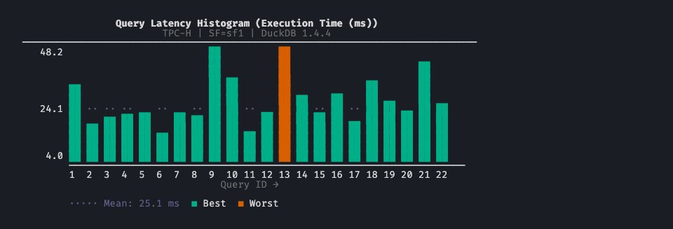
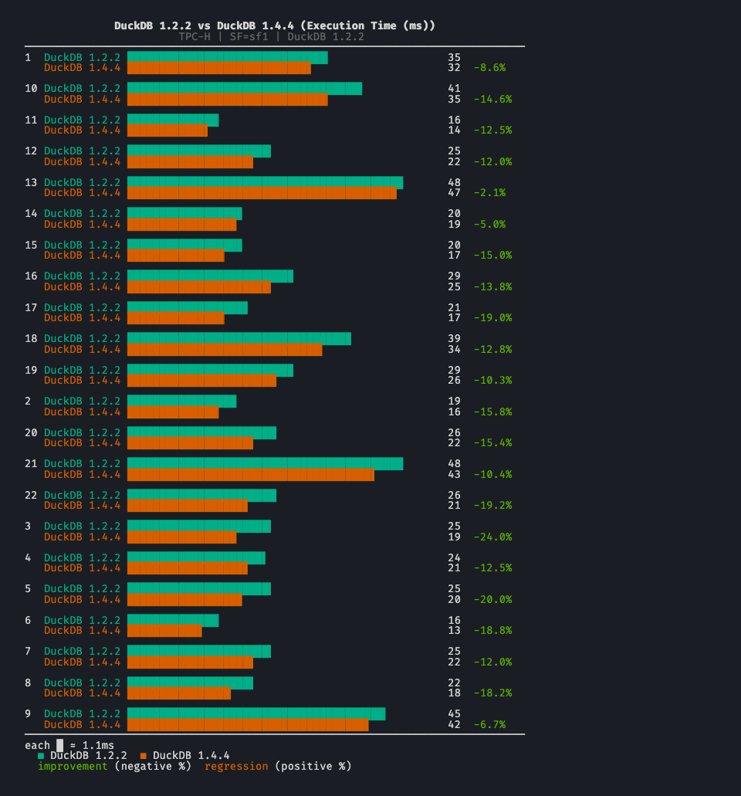
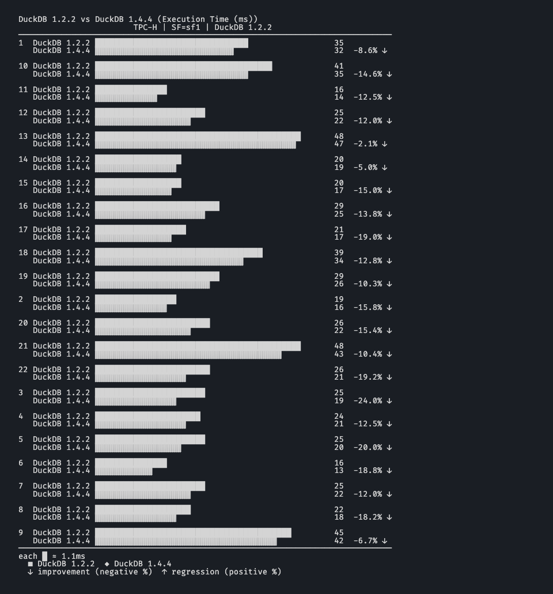
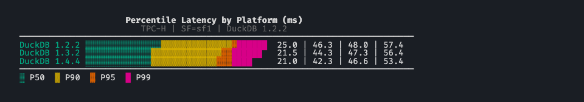
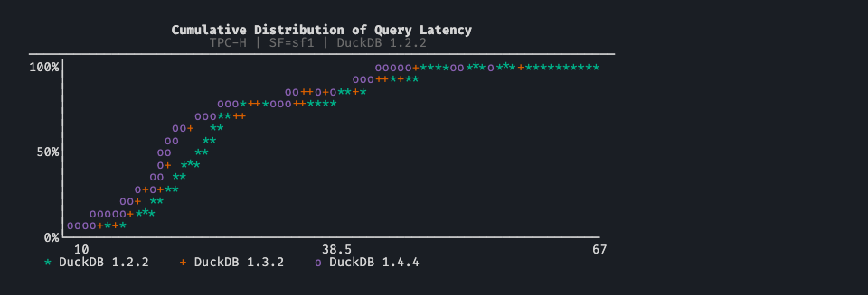
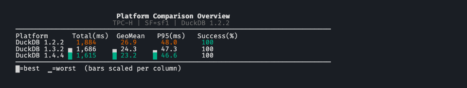
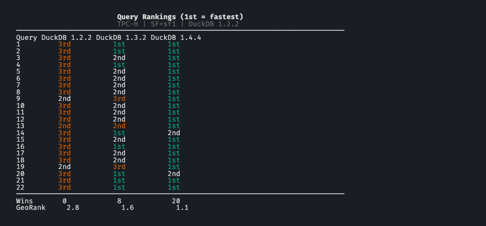
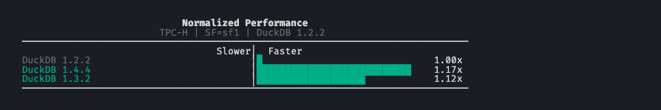

# BenchBox v0.1.3: release summary

BenchBox v0.1.3 was released on **February 23, 2026**.

This post is a summary of what changed in this version, including chart system improvements, driver flexibility, and a faster bulk-loading path for multi-shard data.



## TL;DR

- Charts are now **automatically displayed** at the end of every benchmark run, with no separate visualize step.
- Six new ASCII chart types added: percentile ladder, stacked bar, sparkline table, CDF, rank table, and log2-scaled speedup.
- All chart types now render legibly in **no-color environments** (CI logs, `NO_COLOR`, piped output).
- Drivers for DuckDB, Polars, ClickHouse Connect, and PostgreSQL are now **optional extras** for a leaner default install.
- New `--platform-option driver_version=X.Y.Z` flag pins any platform driver to a specific version.
- Bulk multi-shard loading speeds up TPC-DS ingestion on DuckDB and ClickHouse.

## At a glance

| Area              | What changed in v0.1.3                                                              | Why it matters                                               |
| ----------------- | ----------------------------------------------------------------------------------- | ------------------------------------------------------------ |
| Charts - auto-run | Post-run summaries generated and displayed automatically                            | Immediate feedback without a separate visualize step         |
| Charts - new types | Percentile ladder, stacked bar, sparkline table, CDF, rank table, normalized speedup | More analysis options without leaving the terminal           |
| Charts - no-color | Fill-pattern and glyph fallbacks for CI, `NO_COLOR`, piped output                  | Charts are readable in any environment                       |
| Chart templates   | 3 new bundles: `latency_deep_dive`, `regression_triage`, `executive_summary`        | Pre-composed chart sets for common analysis flows            |
| Driver pinning    | `--platform-option driver_version=X.Y.Z` with optional auto-install                | Reproducible benchmarks across different driver releases     |
| Optional extras   | DuckDB, Polars, ClickHouse Connect, psycopg2 no longer hard dependencies            | Leaner installs; each driver can be pinned independently     |
| Bulk loading      | `load_table_bulk()` for DuckDB (CSV, Parquet) and ClickHouse Native                 | Measurably faster TPC-DS ingestion with sharded data         |
| Reliability       | DataFrame cache path fix, ClickHouse decompression fix, display-name corrections   | Fewer silent failures during data generation and load phases |

## What changed for typical workflows

### 1. Charts appear after every benchmark run

**Before**: chart output required a separate `benchbox visualize` call after the run completed.

**Now**: post-run summaries are generated and displayed automatically at the end of every `benchbox run` invocation.

- No separate step to see query time distributions or performance summaries.
- MCP `run_benchmark` responses include inline chart content.
- The default chart template for each benchmark type is used automatically.

### 2. More chart types and legible output in any environment

**Before**: seven chart types, all relying on ANSI color codes for series differentiation.

**Now**: thirteen chart types, all with greyscale and no-color fallbacks.

New types added:
- Percentile ladder (p50/p95/p99 distribution across queries)
- Stacked bar (multiple metrics per query)
- Sparkline table (compact per-query trend lines)
- CDF (cumulative distribution of query times)
- Rank table (queries ranked by metric with delta indicators)
- Normalized speedup (log2-scaled comparison to a baseline)

In environments where color is unavailable, bar charts use Unicode fill blocks for series differentiation, comparison bars use hatch patterns, and heatmap cells use glyph-based shading. A shared no-color detection path applies across all chart renderers.





Three new template bundles map to common analysis scenarios:
- `latency_deep_dive`: percentile ladder, CDF, query time breakdown
- `regression_triage`: comparison bar, rank table, sparkline
- `executive_summary`: high-level summaries for reporting

### 3. Driver version pinning and optional extras

**Before**: platform drivers were hard dependencies installed at fixed versions. Testing against a different driver version required manual environment changes.

**Now**: `--platform-option driver_version=X.Y.Z` pins the driver for a specific run. Pair with `driver_auto_install=true` and BenchBox installs the requested version automatically via `uv`.

```bash
benchbox run --platform duckdb --benchmark tpch \
  --platform-option driver_version=1.1.3 \
  --platform-option driver_auto_install=true
```

The active driver version is displayed in the run announcement line.

On the install side, DuckDB, Polars, ClickHouse Connect, and psycopg2 are no longer hard dependencies. The default install is leaner; use `pip install benchbox[duckdb]` (or `benchbox[all]`) to restore the previous behavior.

## Major additions

### ASCII chart system

v0.1.3 adds six new chart types to the seven introduced in v0.1.2, bringing the total to thirteen. The new types cover the analysis scenarios most commonly needed after a benchmark run:

- **Percentile ladder**: p50/p95/p99 distribution across queries in a vertical layout
- **Stacked bar**: multiple metrics or run comparisons per query
- **Sparkline table**: compact per-query trend lines across runs
- **CDF**: cumulative distribution of query times across percentiles
- **Rank table**: queries ranked by a metric with delta indicators
- **Normalized speedup**: log2-scaled comparison against a baseline platform or run











All chart types, including the original seven, now have greyscale and no-color fallbacks. Bar charts use Unicode fill blocks, comparison bars use hatch patterns, and heatmap cells use glyph-based shading. This makes chart output readable in CI logs, `NO_COLOR` environments, and piped contexts without any configuration.

Three new template bundles compose these types into common analysis workflows:
- `latency_deep_dive`: percentile ladder, CDF, query time breakdown
- `regression_triage`: comparison bar, rank table, sparkline
- `executive_summary`: high-level summaries for reporting

Post-run charts are now automatically generated and displayed at the end of every `benchbox run` invocation. MCP `run_benchmark` responses include the chart content inline.

### Bulk multi-shard table loading

TPC-DS runs on DuckDB and ClickHouse with sharded data are measurably faster in v0.1.3, with no configuration changes required. Previously, multi-shard tables were ingested shard by shard. The DataLoader now ingests them in a single native bulk call. DuckDB (CSV and Parquet) and ClickHouse Native are the first implementations of the new path.

## Major fixes and stability work

v0.1.3 includes several fixes that are easy to miss in the feature headlines but affect everyday reliability.

### DataFrame cache path mismatch

DataFrame mode cached generated data under a different directory structure than SQL mode, which forced redundant data generation when switching between modes on the same scale factor. Both modes now share a flat layout, so cached data is reused correctly.

### ClickHouse zstd double-decompression

`ClickHouseNativeHandler` was applying manual zstd decompression on top of the driver's built-in decompression, corrupting data during compressed bulk loads. The double-decompression is eliminated in v0.1.3.

### Platform display names

Corrected display names for several platforms:
- Amazon Athena (was "AWS Athena")
- Google Cloud Dataproc (was "GCP Dataproc")
- Databricks (now "Databricks SQL")
- Microsoft Azure platform names updated

`adapter.get_platform_info()` propagated to match in all cases.

### Other fixes

- Driver auto-install version switching: `sys.modules` and metadata caches are now invalidated after a version swap, so the requested driver version is used for the full run.
- Ranking normalization crash when all metric values are negative finite numbers.
- PySpark SIGINT handler hanging `pytest-xdist` workers in medium-speed test runs.
- `--validation-mode` CLI prompt crash when `spec.default` is not a string.
- CLI warning logged when a platform option's default value is not in the declared choices list.

## Changed behavior to be aware of

- DuckDB, Polars, ClickHouse Connect, and psycopg2 are no longer installed by default. If your workflow uses these platforms, add the relevant extras after upgrading: `pip install benchbox[duckdb]` or `pip install benchbox[all]`.
- All user-facing terminal output in the run pipeline now flows through `emit()`. `--quiet` suppression and output capture in tests are now consistent across all pipeline stages.

## Quick upgrade checks

After upgrading to v0.1.3:

1. Confirm installed version:

```bash
benchbox --version
```

2. Add extras for any platforms your team uses:

```bash
pip install "benchbox[duckdb,polars]"
# or, to restore the previous all-inclusive install:
pip install "benchbox[all]"
```

3. Run a smoke benchmark and confirm post-run charts appear automatically:

```bash
benchbox run --platform duckdb --benchmark tpch --scale 0.01 --phases power --non-interactive
```

4. If your team benchmarks against multiple driver versions, test the pinning flag:

```bash
benchbox run --platform duckdb --benchmark tpch --scale 0.01 \
  --platform-option driver_version=1.1.3 \
  --platform-option driver_auto_install=true
```

5. If running TPC-DS with sharded data on DuckDB or ClickHouse, you should see a load time improvement without any configuration changes.

## Bottom line

v0.1.3 builds on the ASCII chart foundation from v0.1.2:

- charts appear automatically after every run with no separate step,
- thirteen chart types cover the most common benchmark analysis scenarios,
- and no-color fallbacks make output usable in CI and piped contexts.

For teams already running BenchBox, this version is about **results that surface automatically** and benchmark runs that stay reproducible across driver versions.

## Reference

- Changelog entry: `CHANGELOG.md` (`[0.1.3] - 2026-02-23`)
