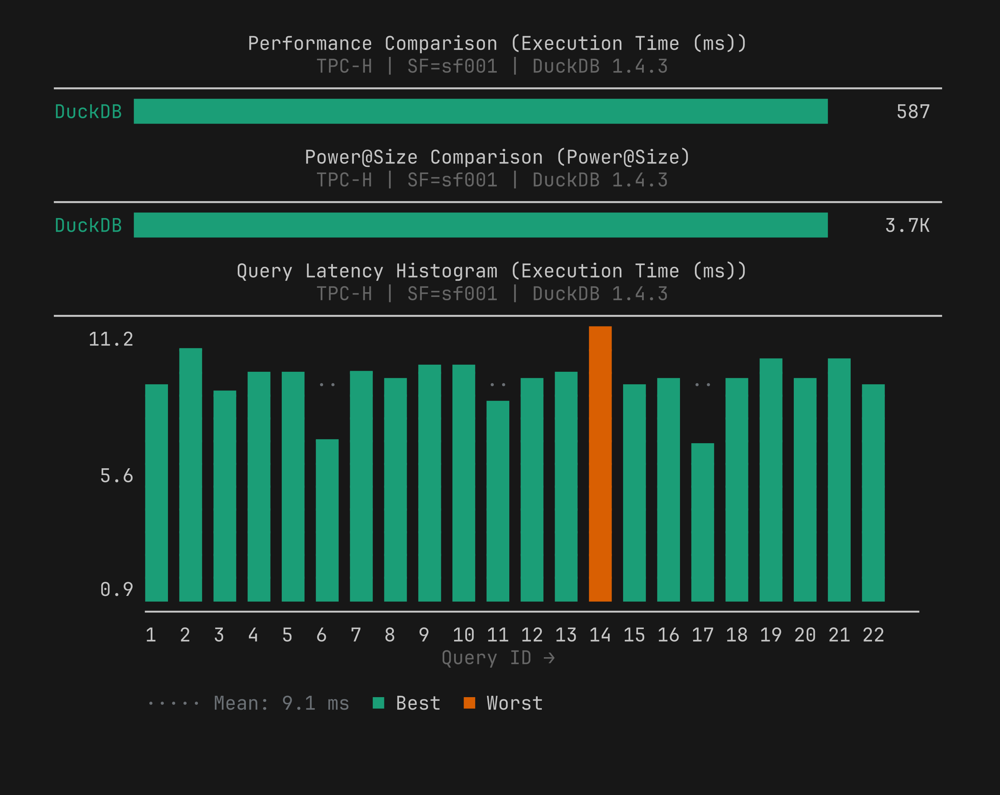
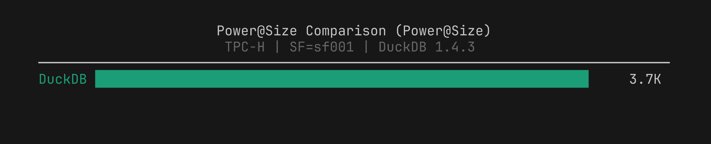

# BenchBox v0.1.4: release summary

BenchBox v0.1.4 was released on **March 3, 2026**.

This post is a summary of what changed in this version, including plan capture accuracy, chart correctness under skewed data, and result metadata fidelity across load and datagen phases.



## TL;DR

- `--capture-plans` now defaults to `EXPLAIN (ANALYZE, FORMAT JSON)` behavior (`analyze_plans=True`) so captured plans include measured timing, not just optimizer estimates.
- New `power_bar` chart type visualizes TPC Power@Size scores. Added to five built-in templates.
- ASCII chart rendering handles outliers correctly across all chart types. Extreme values no longer compress the rest of the chart into an unreadable sliver.
- Per-table load timings and datagen phase duration are now recorded and exported in result files.
- SSB dot-notation query IDs (for example `Q2.1`) now work end-to-end in `--queries` and plan-related CLI flows.
- `--quiet` output now emits only the bare result filepath to stdout for scripting and CI.

## At a glance

| Area | What changed in v0.1.4 | Why it matters |
| --- | --- | --- |
| Query plan capture | Default capture mode now records actual timing (`EXPLAIN ANALYZE`) | Plan data matches what the query actually did, not what the optimizer predicted |
| Charts - power_bar | New TPC Power@Size chart + template integration | Compare throughput across versions/platforms at a glance |
| Charts - outlier handling | Outlier capping improved across all chart types | Extreme queries no longer collapse the rest of the chart |
| Result timing metadata | Per-table load timings and phase durations propagate reliably | Complete timing picture across all phases in result files |
| SSB query IDs | Dot notation IDs preserved through normalization and CLI | SSB subsets and plan inspection behave correctly |
| Quiet mode | Bare filepath output contract in `--quiet` | Easier scripting: pipe result path directly without parsing output |
| Runtime environment | ABI validation for isolated driver installs | Prevents crashes from incompatible driver binaries |

## What changed for typical workflows

### 1. Plan capture now defaults to actual execution timing

**Before**: `--capture-plans` ran `EXPLAIN (FORMAT JSON)`, capturing the optimizer's estimated plan: structure, estimated rows, estimated costs. This was useful for understanding plan shape, but the timing shown was the optimizer's prediction, not measured execution time.

**Now**: we default to `EXPLAIN (ANALYZE, FORMAT JSON)`. The captured plan includes actual elapsed time per node, actual row counts, and loop counts, the same data you'd see running EXPLAIN ANALYZE interactively in DuckDB or psql.

This matters when diagnosing regressions. The plan shape might not have changed, but a specific node's actual runtime can reveal where time went. Version comparisons with plan capture enabled now show whether the optimizer changed its strategy *and* whether that actually changed execution time.

We also fixed several issues in the plan capture pipeline: DuckDB's JSON plan format (dict `extra_info` handling), plan preservation through the normalization pipeline, and result loading consistency in `show-plan` / `compare-plans`.

To opt out per-platform, set `analyze_plans: false` in your tuning config if you want estimated plans only:

```yaml
# tuning.yaml
analyze_plans: false
```

Or via the CLI:

```bash
benchbox run --platform duckdb --benchmark tpch --scale 0.01 \
  --capture-plans \
  --platform-option analyze_plans=false
```

### 2. Throughput comparisons with power_bar

We added a new `power_bar` chart type that visualizes TPC Power@Size scores as a horizontal bar chart. Higher bars mean better throughput, the opposite of `performance_bar` where lower is better. The chart is safe to include in any template: it renders only when TPC metric data is present and is skipped silently for non-TPC runs.

We added `power_bar` to five templates: `flagship`, `head_to_head`, `trends`, `regression_triage`, and `executive_summary`.

```bash
benchbox visualize benchmark_runs/results/<result>.json --chart-type power_bar
```



### 3. Outlier handling in ASCII charts

**Before**: one very slow query (a cold-cache outlier or a query with a bad plan) could compress everything else in a chart into a few characters at the left edge, making the chart useless for comparing the rest of the queries.

**Now**: we apply outlier truncation across all chart types. Values beyond the capping threshold are marked with a truncation indicator; the axis scales to the non-outlier range.

This applies to bar, histogram, stacked bar, scatter, line, CDF, percentile ladder, and heatmap paths. We also fixed box plot severity marker interleaving in this release.

Additional chart improvements:
- Natural sort for query IDs (Q1, Q2, ..., Q10 instead of Q1, Q10, Q11, Q2)
- Color cycling correctness
- Effective width cap raised from 120 to 400 characters (better on wide terminals and in MCP responses)

## Major additions

### Driver-version-aware chart labeling

Multi-platform chart series labels and run summaries now include driver version context. This makes versioned driver comparisons easier to interpret at a glance.

### Runtime ABI validation for isolated driver installs

We added ABI compatibility checks to isolated runtime discovery. This catches incompatible runtime/driver combinations early and avoids SIGSEGV-class crashes from incompatible driver binaries.

### Presorted data-generation modes for table formats

We expanded data-generation and organization support with:
- `parquet-sorted` output mode,
- `delta-sorted` and `iceberg-sorted` organization paths,
- clustering primitives (z-order, Hilbert, partition-aware sort),
- and `cluster-by` tuning integration.

## Major fixes and stability work

v0.1.4 closes a set of correctness issues across plans, results, and runtime handling:

- **Plan capture pipeline**: We fixed forwarding of `capture_plans` through `RunConfig`, DuckDB JSON plan edge cases, query plan preservation through normalization, and result loading consistency in `show-plan`/`compare-plans`.
- **SSB query handling**: dotted IDs like `Q2.1` are now preserved and accepted in query selection.
- **Result pipeline accuracy**:
  - Load/datagen duration propagation and corrected load-phase duration keying
  - Per-table load timings now appear in `table_statistics` in result files
  - Datagen manifest stats (files generated, rows, duration) now surfaced in phase metadata
  - Explicit duration override handling in result builders
- **Runtime environment**: We fixed interpreter targeting and `auto_install_used` propagation, plus crash prevention in matching-version auto-install paths.
- **Additional correctness**: restored `ai_primitives` registry fallback, corrected SQLite `force_recreate` option handling, fixed SSB customer row-count expectation in `SSBRowCountStrategy`, and resolved visualize command stability for multi-series output.

## Changed behavior to be aware of

- **Plan capture mode changed**: `--capture-plans` now runs EXPLAIN ANALYZE by default. This adds query execution overhead during plan capture runs (queries execute twice: once for the benchmark result, once for the plan). Use `analyze_plans: false` to opt out.
- **`make test-all` resource policy changed**: resource-heavy tests are now serialized and slow/performance suites are moved into a dedicated stress lane. This is an internal change that does not affect benchmark workflows, but developers running the full test suite will see different lane behavior.

## Quick upgrade checks

After upgrading to v0.1.4:

1. Confirm installed version:

```bash
benchbox --version
```

2. Run a quick smoke benchmark:

```bash
benchbox run --platform duckdb --benchmark tpch --scale 0.01 --phases power --non-interactive
```

3. If using `--capture-plans`, confirm EXPLAIN ANALYZE timing appears in plan output:

```bash
benchbox run --platform duckdb --benchmark tpch --scale 0.01 --capture-plans --non-interactive
```

4. If using SSB with query selection, verify dot-notation IDs work:

```bash
benchbox run --platform duckdb --benchmark ssb --scale 0.01 --queries Q2.1,Q3.2 --non-interactive
```

5. If your automation uses `--quiet`, update to capture the bare result filepath from stdout.

## Bottom line

v0.1.4 is a correctness release. Plan data now reflects what queries actually did, not what the optimizer predicted. Chart output stays readable even when one query dominates the scale. Result metadata carries timing through all phases without gaps. None of these are new features; they're what we found and fixed by using v0.1.2 and v0.1.3 under real conditions.

If you run into anything unexpected after upgrading, open an issue and we'll take a look.

## Reference

- Changelog entry: `CHANGELOG.md` (`[0.1.4] - 2026-03-03`)
