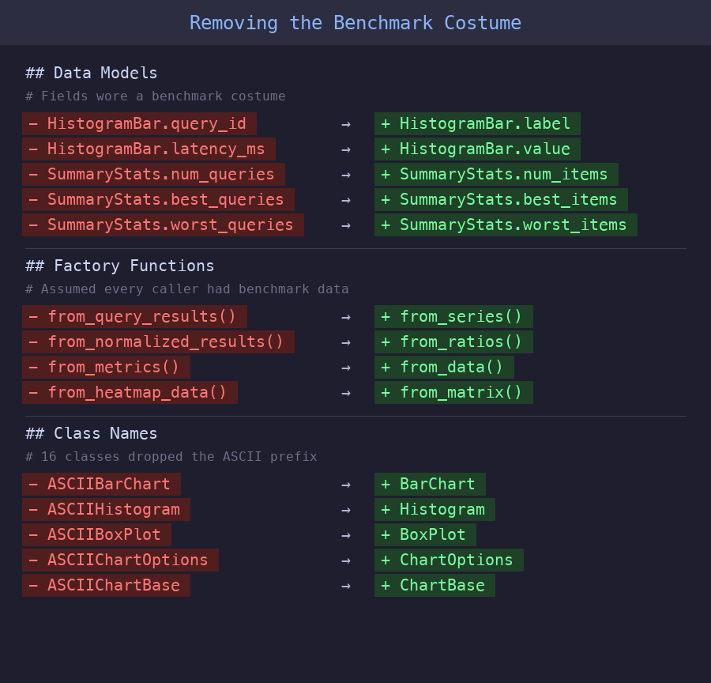

# Extracting textcharts from BenchBox exposed hidden coupling

> When we pulled BenchBox's ASCII charts into `textcharts`, one lazy import and a benchmark-shaped API turned out to be the hard part.

**TL;DR**: We extracted BenchBox's 7,500-line ASCII charting system into `textcharts`, a standalone zero-dependency library on PyPI. The extraction forced us to rename benchmark-specific APIs to generic ones, decouple a hidden dependency, and move ~290 test methods out of BenchBox. The result: a cleaner BenchBox and a charting library anyone can use.

---

## Introduction

In [our first post in this series](2026-02-15-why-we-deleted-plotly.md), we described building ASCII charts for BenchBox: 15 chart types, zero dependencies, inline rendering for terminals and LLMs (large language models). By March 2026, that system had grown into `textcharts` in all but name: 7,500 lines across 19 modules with no runtime dependency on BenchBox's benchmark engine.

The code had no real coupling to BenchBox's benchmarking logic, since all it did was render bar charts and histograms, detect terminal capabilities, and draw Unicode box characters. None of that requires a benchmarking framework. But the naming told a different story: classes were called `ASCIIBarChart` and `ASCIIHistogram`, data fields were named `query_id` and `latency_ms` when they were really just labels and values, and factory functions like `from_query_results()` assumed every caller had benchmark data. We had built a general-purpose visualization library and then hard-coded benchmark terminology into its entire public surface, which meant we couldn't share the charting code with other projects without pulling in BenchBox's package hierarchy.

Three things pushed us to extract:

1. **Reuse**: MCP (Model Context Protocol) servers, CLI tools, and dashboards could all use terminal charts, but not if they required a benchmarking framework as a dependency.
2. **Maintenance boundary**: Our test file for ASCII charts had grown to ~4,500 lines, mixing pure rendering tests with BenchBox integration tests. A histogram rendering bug and a data-conversion bug looked identical in test output.
3. **One hidden import**: Deep in `base.py`, a single line imported `format_scale_factor` from BenchBox's utility package. That one import made the entire 7,500-line package non-extractable.

---

## Three phases, not a big bang

We split the extraction into three phases. The first two improved BenchBox's architecture before any code left the repository.

### Phase A: Prepare the boundary

**Facade consolidation.** Five modules across BenchBox (CLI, MCP tools, exporters, post-run summary, and chart generator) were making ~28 deep submodule imports, each reaching into specific chart files like `ascii.histogram` or `ascii.comparison_bar`. We consolidated all of these behind a 22-line `ascii_api.py` facade, a small public module that re-exported the charting surface from one place, and switched all five callers to the single import path.

**Decouple the hidden import.** That `format_scale_factor` import turned out to be a lazy import buried inside a subtitle-rendering method. We replaced it with an optional callable on `ChartOptions`:

```python
@dataclass
class ChartOptions:
    # ... width, height, color, unicode, theme ...
    scale_factor_formatter: Callable[[float], str] | None = field(default=None, repr=False)
```

BenchBox injects its formatter at the call site, and the charting library falls back to `f"SF={sf}"` when no formatter is provided, so one new field eliminated the only cross-boundary import.

**Golden snapshots.** Before moving any code, we captured byte-identical output for all 15 chart types as golden test fixtures and ran them at every phase boundary to catch rendering drift.

### Phase B: Extract and shim

We scaffolded a standalone `textcharts` package with a src layout, a `py.typed` marker so type checkers know the package ships inline types, zero runtime dependencies, and an MIT license, then dropped the `ASCII` prefix from all 16 class names so that `ASCIIBarChart` became `BarChart` and `ASCIIChartOptions` became `ChartOptions`.

Back in BenchBox, the original `ascii/` modules became thin compatibility shims, small re-export files that preserved the old import paths, each about three lines long:

```python
"""Compatibility shim, delegates to textcharts.histogram."""
from textcharts.histogram import *  # noqa: F401, F403
```

The 17 shim files totaled just 60 lines, and BenchBox's 568 visualization tests passed without modification on the first run because the shims preserved every existing import path.

### Phase C: De-BenchBox the API

This turned out to be the unexpected payoff. Once the library stood on its own, the benchmark-specific naming looked wrong, so we renamed fields and factory functions to be domain-agnostic:

| Before (benchmark-specific) | After (generic) |
| --------------------------- | --------------- |
| `HistogramBar.query_id`     | `.label`        |
| `HistogramBar.latency_ms`   | `.value`        |
| `SummaryStats.num_queries`  | `.num_items`    |
| `SummaryStats.best_queries` | `.best_items`   |
| `from_query_results()`      | `from_series()` |
| `from_normalized_results()` | `from_ratios()` |
| `from_heatmap_data()`       | `from_matrix()` |



Each rename forced BenchBox to make its data transformation explicit. Where chart classes had previously accepted benchmark-shaped data silently through field names, the dispatch layer in `ascii_runtime.py` now explicitly maps BenchBox's domain concepts to generic chart fields:

```python
# BenchBox domain (query_id, execution_time_ms) -> textcharts (label, value)
histogram_data.append(
    HistogramBar(label=query_id, value=mean_latency, platform=platform)
)
```

That mapping was always happening, but now it's visible, testable, and documented.

---

## What improved in BenchBox

The extraction made BenchBox better, not just smaller. The line between "what to show" (textcharts) and "how to prepare the data" (BenchBox) became a real API contract, and two specific improvements fell out of that separation.

**Smaller, more focused tests.** We moved ~290 pure-rendering test methods (46 test classes) to textcharts, which shrank BenchBox's `test_ascii_charts.py` from ~4,500 lines to 770. The remaining ~65 tests in 13 classes now answer one question: "Does BenchBox pass the right data to charts?" Before the split, rendering tests and integration tests were interleaved, so any failure required carefully reading the test to figure out which layer actually broke.

**A hidden dependency cycle.** While tracing imports for the extraction, we discovered that `chart_generator.py` in the visualization layer was importing a private function from `benchbox.mcp.tools.visualization` in the MCP layer. The visualization layer was depending on MCP, an inversion that would have grown worse over time, and the facade gave chart_generator a direct path to the rendering function that eliminated the cycle entirely.

The trade-off is operational rather than architectural. BenchBox now depends on one more package release, and we need to carry the compatibility shims until the old import paths can be retired cleanly.

---

## Methodology and sources

This post is an architecture retrospective, not a runtime benchmark report, so the numbers here describe code structure rather than hardware performance. Unless noted otherwise, counts such as 7,500 lines, 19 modules, 17 shim files, and ~290 moved test methods come from source-tree measurements we collected during the extraction work on March 10, 2026, using BenchBox v0.1.4 locally and the standalone `textcharts` package at the same migration point.

Approximate figures are rounded because they summarize moved test methods and pre-extraction file sizes from the research notes rather than a single immutable file snapshot. The accepted ADR from March 5, 2026 documents the ownership boundary and migration constraints that shaped the extraction.

---

## Conclusion

**Extraction is a design tool, not just a packaging exercise.** The act of making code standalone reveals assumptions baked into naming, imports, and data shapes. We found coupling we didn't know we had, not through static analysis, but by trying to make the code work without its original context.

**Watch for the "one import" problem.** A single cross-boundary import blocked extraction of 7,500 lines, and it wasn't even visible at the top of the module. Lazy imports buried inside methods can hide coupling that a quick scan of your import statements will miss completely.

**Build a safety net before you move.** Two techniques made the extraction low-risk. Golden snapshot tests, 15 fixtures with byte-identical comparison, one per chart type, let us refactor aggressively without manually verifying chart output at every step, and compatibility shims, 17 thin re-export modules totaling 60 lines, meant we could extract without updating every import in BenchBox simultaneously. We'll deprecate the shims eventually, but together these two techniques eliminated the "big bang" migration risk.

**Generic naming is a forcing function.** Renaming `query_id` to `label` sounds trivial, but propagating that change through the codebase forced us to identify every place BenchBox assumed "this chart shows benchmark queries." Some of those assumptions turned out to be wrong, since the same charts also render cost data, throughput metrics, and platform comparisons.

The useful outcome was not just a new package on PyPI. It was a cleaner boundary inside BenchBox, a more honest API in `textcharts`, and a migration path that let us improve both without breaking users.

---

## Try it yourself

```bash
pip install textcharts
```

```python
from textcharts import BarChart, BarData

data = [
    BarData(label="Python", value=89.5),
    BarData(label="Rust", value=95.2),
    BarData(label="Go", value=78.0),
]
print(BarChart(data=data, title="Language Benchmark").render())
```

The library also ships a CLI, `textcharts bar --title "Results"`, which reads JSON on stdin. It also ships an MCP server, `textcharts-mcp`, for AI tool integration. The package stays zero-dependency across 15 chart types on Python 3.10+, and BenchBox users are already using it because BenchBox v0.1.4 depends on `textcharts`.

---

## References

1. ["Why we deleted Plotly and wrote our own ASCII charts"](2026-02-15-why-we-deleted-plotly.md), Building BenchBox series
2. [`textcharts` on PyPI](https://pypi.org/project/textcharts/) and [GitHub](https://github.com/joeharris76/textcharts)
