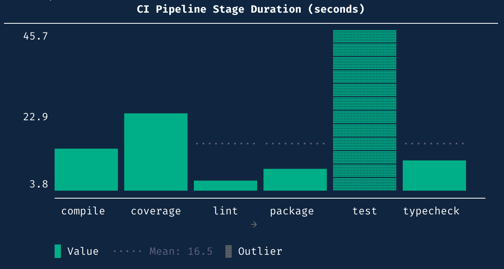

# BenchBox v0.1.5: release summary

BenchBox v0.1.5 was released on **March 10, 2026**.

This post covers what changed in this version: the textcharts extraction, open table format loading, and a test quality overhaul that deleted more tests than it added.



```python
from textcharts import Histogram, HistogramBar

data = [
    HistogramBar(label="compile",   value=12.3),
    HistogramBar(label="test",      value=45.7),
    HistogramBar(label="lint",      value=3.2),
    HistogramBar(label="typecheck", value=8.9),
    HistogramBar(label="coverage",  value=22.1),
    HistogramBar(label="package",   value=6.5),
]
print(Histogram(data=data, title="CI Pipeline Stage Duration (seconds)").render())
```

## TL;DR

- **Textcharts is now a standalone library.** All 15 ASCII chart types extracted into `packages/textcharts/` with zero BenchBox dependencies. Existing BenchBox imports work through compatibility shims.
- **Open table format loading** for Delta Lake, Iceberg, and Hudi across Spark mixin platforms, cloud SQL platforms, and Snowflake/ClickHouse adapters.
- Format capability registry expanded to cover Hudi, Presto/Trino, BigQuery, Redshift, and cloud lakehouse platforms. Inaccurate registrations removed.
- **Test quality overhaul**: 13 hollow test files deleted and replaced with behavior-verifying adapter tests. Mutation testing added via `mutmut`.
- Pytest lanes converted from implicit timing heuristics to explicit source markers.
- CLI recursive import fix, CoffeeShop SA2 query correction, textcharts v0.1.2 API migration.

## At a glance

| Area | What changed in v0.1.5 | Why it matters |
| --- | --- | --- |
| Textcharts extraction | 15 chart types in standalone package; BenchBox depends via path dep | Charts are reusable outside BenchBox; internal coupling removed |
| Table format loading | Delta/Iceberg/Hudi load support on Spark, cloud SQL, Snowflake, ClickHouse | Benchmarks can load data in native table formats |
| Format registry | Capabilities registered for 10+ additional platforms; inaccurate entries removed | Registry reflects what actually works, not aspirational support |
| Test quality | 13 hollow files deleted, mutation testing added, 150 assertions strengthened | Tests catch real bugs instead of inflating coverage numbers |
| Pytest lanes | Explicit source markers replace timing-based bucketing | Lane assignment is deterministic and auditable |
| Fixes | CLI recursive import, CoffeeShop query, textcharts API migration | Fewer startup failures, correct query results |

## What changed for typical workflows

### 1. Textcharts is now a standalone library

We wrote about the extraction process in detail in [post #6](2026-03-10-extracting-textcharts.md). This section covers what shipped and what it means for BenchBox users.

**What users see**: nothing breaks. The `benchbox visualize` command and MCP chart tools work exactly as before. Existing `benchbox.core.visualization.ascii.*` imports resolve through compatibility shims. No migration is required.

**What changed internally**: `packages/textcharts/` is a standalone Python package with its own `pyproject.toml`, README with chart gallery and API reference, and test suite. BenchBox depends on it as a path dependency. All 15 chart types are exported with clean standalone names (`BarChart`, `Histogram`, `Heatmap`) alongside BenchBox-compatible aliases (`ASCIIBarChart`, `ASCIIQueryHistogram`).

The migration touched more than just the package boundary:

- ~316 pure-rendering tests moved to the textcharts test suite
- Shim import smoke tests retained in BenchBox to verify re-export paths
- `ASCII*`-prefixed class names renamed in 10 source and test files
- 3 deprecated factory imports removed
- Golden snapshots regenerated for textcharts v0.1.2 API changes
- Magic numbers extracted to named constants in visualization modules

The shims are not deprecated in this release. We will signal deprecation in a future version before removing them.

### 2. Open table format loading

**Before**: BenchBox could generate data in table format layouts (delta-sorted, iceberg-sorted from v0.1.4), but adapters lacked `load_table` implementations for external formats. The format capability registry listed platforms that didn't actually have loading code.

**Now**: runtime loading support for Delta Lake, Iceberg, and Hudi is implemented across:

- Spark mixin platforms (EMR, Dataproc, Glue, Fabric Spark, Synapse Spark, Dataproc Serverless)
- Cloud SQL platforms (Snowflake, ClickHouse)

Format support is gated on adapter configuration, so platforms without loading code don't advertise capabilities they can't deliver. The registry was also cleaned up: LakeSail removed from delta/iceberg/hudi capabilities, platform display names normalized to match registry keys, and platforms without loading code removed from format registrations entirely.

```bash
benchbox run --platform duckdb --benchmark tpch --scale 0.01 \
  --table-mode external --platform-option table_format=iceberg
```

### 3. Test suite quality overhaul

This is the release where we addressed coverage theater. The test suite looked healthy by line coverage metrics, but many tests were hollow: `assert result is not None`, `isinstance` checks, `MagicMock` objects that never verified behavior.

**What we deleted**: 13 test files that existed primarily to inflate coverage numbers. These files tested that constructors returned non-None values and that objects had expected types, but never exercised actual behavior.

**What we added**:

- Behavior-verifying tests for DuckDB, SQLite, and DataFusion adapters using real file operations, not mocked paths
- Real file-based credential tests replacing mock-only coverage
- Mutation testing via `mutmut` targeting 5 critical modules (`duckdb.py`, `adapter.py`, `runner.py`, `chart_generator.py`, `run.py`)
- 150 `is-not-None` assertions rewritten as behavioral checks across 5 files
- `isinstance` assertions replaced with behavioral checks in 3 files
- `MagicMock` replaced with `SimpleNamespace` for attribute-only test objects

Coverage enforcement changed from per-file thresholds to a suite-wide 60% minimum. The coverage number may have gone down; the mutation survival rate went down too, which is what matters.

## Major fixes and stability work

### CLI recursive import

A circular lazy-import in the benchmarks module caused a `RecursionError` on CLI startup in certain import orderings. We restructured the import path to break the cycle.

### CoffeeShop SA2 query

The `group_by` column in the SA2 query referenced `'name'` instead of `'product_name'`, producing incorrect aggregation results. Corrected.

### Textcharts API migration

After the textcharts v0.1.2 release introduced breaking changes to class names and factory functions, we migrated BenchBox's integration layer: renamed `ASCII*`-prefixed classes across 10 source and test files, removed 3 unused deprecated factory imports, and regenerated golden snapshots for the updated defaults.

### pytest-xdist worker title patch

The xdist worker title monkeypatch was too broad, causing test pollution across parallel workers. We tightened the patch scope.

### Pytest lane restructure

Test lanes (fast, medium, slow) were previously assigned based on measured execution timings, which meant lane membership could shift between machines or after unrelated code changes. We converted lanes to explicit source markers with static assignment. Stress tests are now serialized, cloud adapter tests re-laned to `slow+cloud_import`, and the fast lane restored to lightweight tests only. We also documented pytest-xdist safety requirements for future contributors.

## Changed behavior to be aware of

- **Import paths**: existing `benchbox.core.visualization.ascii.*` imports still work through compatibility shims. The canonical import path for the charting library is now `textcharts.*`, but no migration is required in this release.
- **Test lane markers**: if you run tests with custom pytest marker filters, the marker names haven't changed, but lane membership may have shifted for some tests after the rebucketing.
- **Coverage enforcement**: per-file coverage thresholds are removed. The suite-wide threshold is 60%.

## Quick upgrade checks

After upgrading to v0.1.5:

1. Confirm installed version:

```bash
benchbox --version
```

2. Run a smoke benchmark and confirm chart output renders:

```bash
benchbox run --platform duckdb --benchmark tpch --scale 0.01 --phases power --non-interactive
```

3. If you import BenchBox chart classes directly, confirm your imports still resolve:

```python
from benchbox.core.visualization.ascii import ASCIIBarChart  # shim path, still works
from textcharts import BarChart  # new canonical path
```

4. If using table format loading, verify format support is reported for your target platform:

```bash
benchbox run --dry-run /dev/null --platform duckdb --benchmark tpch \
  --table-mode external --platform-option table_format=iceberg
```

## Bottom line

v0.1.5 is a housekeeping release. We separated a library, cleaned up the format registry, and replaced coverage theater with tests that catch mutations.

The textcharts extraction, which we covered in [post #6](2026-03-10-extracting-textcharts.md), ships here as a dependency change. For users, nothing looks different: charts render the same way, the same commands work. For the project, the boundary between "what to render" and "how to prepare the data" is now an explicit package contract instead of an implicit directory convention.

The test quality work is less visible but equally important. Deleting 13 test files to improve quality feels counterintuitive, but the remaining tests are the ones that catch real regressions. Mutation testing with `mutmut` gives us a way to verify that going forward.

Open table format loading rounds out the data pipeline: v0.1.4 added sorted generation paths, and v0.1.5 adds the loading side so benchmarks can ingest Delta, Iceberg, and Hudi data natively on supported platforms.

If you run into anything unexpected after upgrading, open an issue and we'll take a look.

## Reference

- Changelog entry: `CHANGELOG.md` (`[0.1.5] - 2026-03-10`)
- Post #6: ["Extracting textcharts from BenchBox exposed hidden coupling"](2026-03-10-extracting-textcharts.md)
