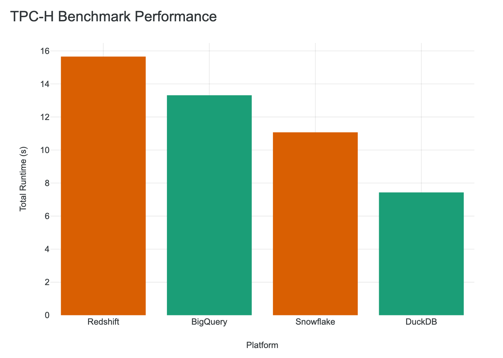
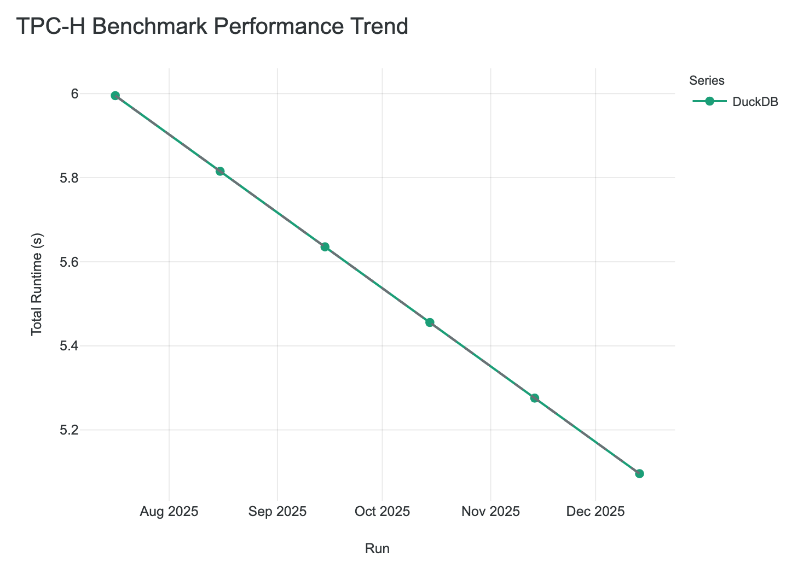
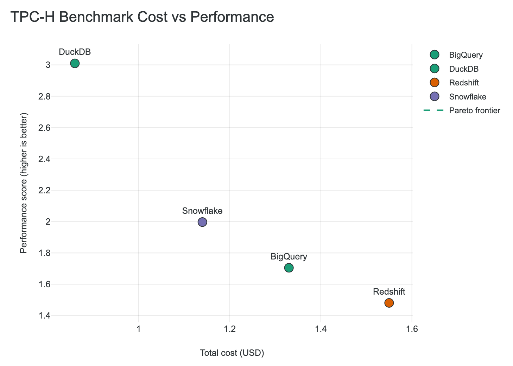
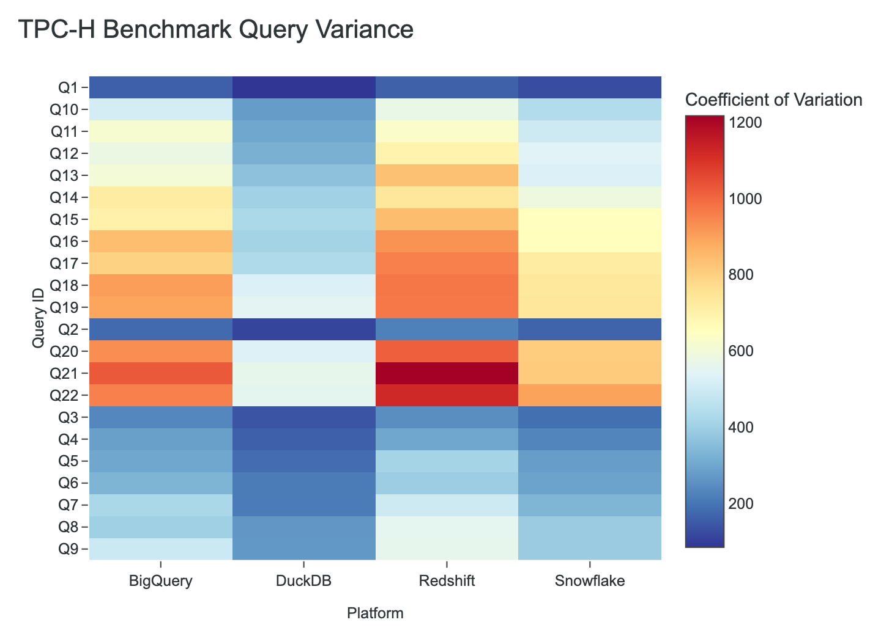

# Chart Types

```{tags} intermediate, reference, visualization
```

BenchBox provides five publication-ready chart types optimized for benchmarking narratives. Each chart is designed for a specific analytical purpose and can be generated via `benchbox visualize` or programmatically through the Python API.

## Performance Bar Chart

**Purpose:** Compare execution times across platforms, runs, or configurations. The most common chart for "which platform is fastest?" questions.

**Key Features:**
- Automatic best/worst highlighting (green for fastest, red for slowest)
- Error bars for variance visualization
- Grouped or stacked bar modes
- Automatic sorting by performance (configurable)
- Platform labels with execution time annotations



*TPC-H SF10 comparison across 4 platforms showing DuckDB as fastest (green) and Redshift as slowest (red)*

**Data Requirements:**
- `total_time_ms` or `avg_time_ms` per result
- At least 1 result (multiple for comparison)

**Best For:**
- Platform shootouts ("DuckDB vs Snowflake")
- Before/after optimization comparisons
- Multi-benchmark summaries

---

## Time-Series Line Chart

**Purpose:** Track performance evolution over time, across versions, or across sequential runs. Essential for regression detection and trend analysis.

**Key Features:**
- Multi-line support for comparing platforms over time
- Dashed regression/trend overlay (least-squares fit)
- Version/timestamp annotations on data points
- Automatic legend with series names



*DuckDB performance trend over 6 months showing improvement with dashed regression line*

**Data Requirements:**
- At least 2 results with timestamps or execution IDs
- `total_time_ms` per result

**Best For:**
- Version-over-version performance tracking
- Regression detection in CI/CD
- Long-term platform evolution stories

---

## Cost-Performance Scatter Plot

**Purpose:** Visualize the price/performance tradeoff with Pareto frontier highlighting. Critical for cloud platform ROI analysis.

**Key Features:**
- Pareto frontier highlighting (optimal cost-performance points)
- Quadrant analysis (fast & cheap vs slow & expensive)
- Platform labels with hover metadata
- Performance score calculation (queries/hour or inverse latency)



*Platform comparison showing Pareto frontier (dashed line) highlighting cost-efficient options*

**Data Requirements:**
- `cost_summary.total_cost` per result
- Performance metric (`avg_time_ms` or `total_time_ms`)

**Best For:**
- Cloud platform cost comparisons
- ROI analysis for platform selection
- "Bang for your buck" narratives

---

## Query Variance Heatmap

**Purpose:** Show per-query performance patterns across platforms. Reveals which queries each platform handles well or poorly.

**Key Features:**
- Query (rows) × Platform (columns) grid
- Color scale for execution time or coefficient of variation
- Automatic sorting by query ID
- Hover details with exact timings



*TPC-H 22-query heatmap showing per-query performance patterns across platforms*

**Data Requirements:**
- At least 2 platforms with per-query `execution_time_ms`
- Query results with `query_id` identifiers

**Best For:**
- Identifying problematic queries per platform
- TPC-H/TPC-DS per-query analysis
- Query optimization targeting

---

## Distribution Box Plot

**Purpose:** Show latency distributions to understand variance, outliers, and consistency beyond simple averages.

**Key Features:**
- Box plot with quartiles (Q1, median, Q3)
- Optional mean and standard deviation markers
- Whiskers showing data spread
- Outlier visualization


*Latency distribution comparison showing variance and consistency across platforms*

**Data Requirements:**
- Per-query `execution_time_ms` values
- Multiple queries per platform for meaningful distribution

**Best For:**
- Consistency analysis (low variance = predictable performance)
- Outlier detection
- SLA compliance stories (P95/P99 analysis)

---

## Chart Selection Guide

| Scenario | Recommended Chart |
|----------|-------------------|
| "Which platform is fastest?" | Performance Bar |
| "How has performance changed over time?" | Time-Series Line |
| "Which platform has best price/performance?" | Cost-Performance Scatter |
| "Which queries does each platform struggle with?" | Query Variance Heatmap |
| "How consistent is query latency?" | Distribution Box |
| "Complete platform evaluation" | Use `--template flagship` for all |

## Data Requirements Summary

| Chart Type | Required Fields | Minimum Results |
|------------|-----------------|-----------------|
| Performance Bar | `total_time_ms` or `avg_time_ms` | 1 |
| Time-Series Line | `total_time_ms` + timestamps | 2 |
| Cost-Performance Scatter | `cost_summary.total_cost` + timing | 1 (2+ useful) |
| Query Variance Heatmap | `queries[].execution_time_ms` | 2 platforms |
| Distribution Box | `queries[].execution_time_ms` | 1 |
