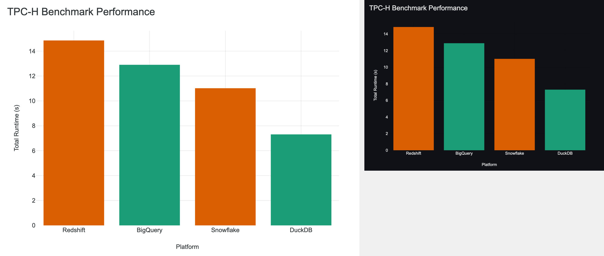
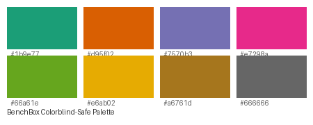

# Customization

```{tags} advanced, guide, visualization
```

BenchBox visualization supports extensive customization for themes, colors, sizing, and export formats.

## Themes

BenchBox provides light and dark themes optimized for different contexts:

```bash
benchbox visualize results/*.json --theme light   # Default, best for print/blog
benchbox visualize results/*.json --theme dark    # Best for dark-mode sites/presentations
```



*Left: Light theme (default) optimized for print and light backgrounds. Right: Dark theme for presentations and dark-mode websites.*

**Theme Differences:**

| Aspect | Light Theme | Dark Theme |
|--------|-------------|------------|
| Background | White (`#ffffff`) | Dark gray (`#1e1e1e`) |
| Text | Dark gray (`#2f3437`) | Light gray (`#e0e0e0`) |
| Grid lines | Light gray (`rgba(0,0,0,0.08)`) | Dark gray (`rgba(255,255,255,0.1)`) |
| Chart palette | Same colorblind-safe colors | Same colorblind-safe colors |

---

## Color Palette

BenchBox uses a colorblind-safe categorical palette designed for data visualization:



*BenchBox's 8-color palette: colorblind-friendly and WCAG AA compliant*

**Palette Colors:**

| Color | Hex | Usage |
|-------|-----|-------|
| Teal | `#1b9e77` | Primary series, best performer |
| Orange | `#d95f02` | Secondary series |
| Purple | `#7570b3` | Tertiary series |
| Pink | `#e7298a` | Fourth series |
| Green | `#66a61e` | Fifth series |
| Yellow | `#e6ab02` | Sixth series |
| Brown | `#a6761d` | Seventh series |
| Gray | `#666666` | Eighth series |

**Special Colors:**

| Purpose | Color | Hex |
|---------|-------|-----|
| Best performer | Green | `#28a745` |
| Worst performer | Red | `#dc3545` |
| Trend line | Gray | `#6b7075` |
| Pareto frontier | Green | `#28a745` |

---

## Export Formats

BenchBox supports four export formats, each optimized for different use cases:

```bash
--format png          # Raster image, universal compatibility
--format svg          # Vector graphics, infinitely scalable
--format pdf          # Print-ready document format
--format html         # Interactive chart with hover/zoom
--format png,svg,html # Multiple formats in one command
```

**Format Comparison:**

| Format | Best For | File Size | Interactive | Scalable |
|--------|----------|-----------|-------------|----------|
| PNG | Blog posts, social media | Medium | No | No (raster) |
| SVG | Print, high-res displays | Small | No | Yes (vector) |
| PDF | Reports, presentations | Medium | No | Yes (vector) |
| HTML | Websites, dashboards | Larger | Yes | Yes |

---

## DPI and Resolution

Control output resolution with `--dpi`:

```bash
--dpi 72    # Web/screen (smaller files, 1280×720 default)
--dpi 150   # Medium quality
--dpi 300   # Print quality (default, 1280×720 at 300 DPI)
--dpi 600   # Ultra high quality (large files)
```

**Resolution Guidelines:**

| Use Case | Recommended DPI | Resulting Size |
|----------|-----------------|----------------|
| Web/blog images | 72-150 | ~100-300 KB |
| Social media | 72 | ~50-150 KB |
| Print/PDF reports | 300 | ~500 KB-2 MB |
| Large format print | 600 | ~2-5 MB |

---

## Chart Sizing

Default canvas: **1280×720 pixels** (16:9 aspect ratio)

This size is optimized for:
- Blog post hero images
- Presentation slides
- Social media (with cropping)

For custom sizing, use the Python API:

```python
from benchbox.core.visualization import ResultPlotter

plotter = ResultPlotter.from_sources(["results.json"])
# Custom sizing requires modifying theme settings
```

---

## Typography

BenchBox uses system fonts with web-safe fallbacks:

- **Primary:** Source Sans Pro
- **Fallback:** Open Sans, Helvetica Neue, Arial, sans-serif

**Font Sizes:**
- Title: 18pt
- Axis labels: 14pt
- Tick labels: 12pt
- Legend: 12pt
- Annotations: 10pt

---

## Accessibility

BenchBox visualizations are designed for accessibility:

**Color Accessibility:**
- Palette passes WCAG AA contrast requirements
- Colorblind-safe: distinguishable for deuteranopia, protanopia, tritanopia
- Patterns available for additional differentiation (Plotly default hatching)

**Screen Reader Support:**
- HTML exports include structured data for screen readers
- Use export metadata to generate alt text for images
- Consistent naming conventions for automated descriptions

**Contrast Ratios:**
- Text on background: minimum 4.5:1
- Chart elements on background: minimum 3:1

---

## Advanced: Python API Customization

For fine-grained control, use the Python API directly:

```python
from benchbox.core.visualization import (
    PerformanceBarChart,
    BarDatum,
    get_theme,
    export_figure,
)

# Custom theme modifications
theme = get_theme("light")
theme.palette = ["#ff0000", "#00ff00", "#0000ff"]  # Custom colors

# Create chart with custom settings
data = [
    BarDatum(label="Platform A", value=100.5, is_best=True),
    BarDatum(label="Platform B", value=150.2),
    BarDatum(label="Platform C", value=200.1, is_worst=True),
]

chart = PerformanceBarChart(
    data=data,
    title="Custom Chart Title",
    metric_label="Custom Y-Axis Label",
    sort_by="label",  # or "value"
    barmode="group",  # or "stack"
)

fig = chart.figure()
export_figure(fig, output_dir="./", base_name="custom", formats=["png", "html"])
```

---

## Configuration Summary

| Option | CLI Flag | Default | Values |
|--------|----------|---------|--------|
| Theme | `--theme` | `light` | `light`, `dark` |
| Format | `--format` | `png,html` | `png`, `svg`, `pdf`, `html` |
| DPI | `--dpi` | `300` | `72`-`600` |
| Smart selection | `--smart/--no-smart` | `--smart` | boolean |
| Output directory | `--output` | `./charts` | path |
