# Documentation to Examples Mapping

This file maps documentation snippets to complete, runnable example files.

## Purpose

**Documentation** (`docs/`) contains simplified code snippets for explanation.
**Examples** (`examples/`) contains complete, tested, runnable programs.

This mapping helps you find the full implementation of concepts shown in the docs.

---

## User Journeys

### Journey 1: From Documentation to Running Code

```mermaid
flowchart TD
    Start([📖 Reading Documentation]) --> Question{Want to run<br/>this code?}
    Question -->|Yes| Table[📋 Check Quick Reference<br/>Table Below]
    Question -->|No| Read[💡 Keep Reading]

    Table --> Find[🔍 Find Example File Path]
    Find --> Navigate[💻 Navigate to Directory<br/>cd examples/category/]
    Navigate --> Run[▶️ Run Example<br/>python file.py]
    Run --> Success[✅ Working Code!]

    Read --> Later[🔖 Bookmark for Later]

    style Start fill:#e1f5ff
    style Success fill:#d4edda
    style Table fill:#fff3cd
```

### Journey 2: From Example File to Understanding Context

```mermaid
flowchart TD
    Start2([💻 Have Example File Open]) --> Question2{Need to understand<br/>the concepts?}
    Question2 -->|Yes| CheckMap[📋 Check This MAPPING.md]
    Question2 -->|No| Code[✨ Start Coding!]

    CheckMap --> FindDocs[📚 Find Related Docs Section]
    FindDocs --> ReadDocs[📖 Read Conceptual Explanation]
    ReadDocs --> Understand[💡 Better Understanding]
    Understand --> Code

    Code --> Success[🚀 Build Something Great!]

    style Start2 fill:#e1f5ff
    style Success fill:#d4edda
    style CheckMap fill:#fff3cd
```

---

## Quick Reference

| Documentation Topic | Runnable Example(s) | Location |
|---------------------|---------------------|----------|
| **Getting Started** | | |
| Basic TPC-H usage | `duckdb_tpch_power.py` | `getting_started/local/` |
| Basic TPC-DS usage | `duckdb_tpcds_power.py` | `getting_started/local/` |
| NYC Taxi analytics | `duckdb_nyctaxi.py` | `getting_started/local/` |
| TSBS DevOps time-series | `duckdb_tsbs_devops.py` | `getting_started/local/` |
| Databricks setup | `databricks_tpch_power.py` | `getting_started/cloud/` |
| BigQuery dry-run | `bigquery_tpch_dry_run.py` | `getting_started/cloud/` |
| Query subset | `duckdb_tpch_query_subset.py` | `getting_started/intermediate/` |
| **Features** | | |
| Test types (Power/Throughput/Maintenance) | `test_types.py` | `features/` |
| Query subsetting | `query_subset.py` | `features/` |
| Tuning comparison | `tuning_comparison.py` | `features/` |
| Result analysis | `result_analysis.py` | `features/` |
| Multi-platform execution | `multi_platform.py` | `features/` |
| Export formats | `export_formats.py` | `features/` |
| Validation mode | `validation.py` | `features/` |
| Batch execution | `batch_execution.py` | `features/` |
| **Dry-Run Mode** | | |
| Basic dry-run | `basic_dry_run.py` | `dry_run/` |
| Analyzing dry-run output | `analyze_dry_run_output.py` | `dry_run/` |
| Query validation | `query_validation.py` | `dry_run/` |
| Documentation generation | `documentation_generator.py` | `dry_run/` |
| CI/CD integration | `ci_validation.py` | `dry_run/` |
| Sample artifacts | Various `.sql`, `.json` files | `dry_run_samples/` |
| **Use Cases** | | |
| CI/CD testing | `ci_smoke_tests.py` | `use_cases/` |
| Platform evaluation | `platform_comparison.py` | `use_cases/` |
| Incremental tuning | `incremental_tuning.py` | `use_cases/` |
| Cost optimization | `cost_optimization.py` | `use_cases/` |
| **Programmatic Workflows** | | |
| Unified runner (advanced) | `unified_runner.py` | `programmatic/` |
| Custom workflow pattern | `custom_workflow.py` | `programmatic/` |
| Data pipeline integration | `data_pipeline_integration.py` | `programmatic/` |
| Results aggregation | `aggregate_results.py` | `programmatic/` |
| Automated reporting | `generate_report.py` | `programmatic/` |
| Configuration validation | `validate_config.py` | `programmatic/` |
| Benchmark orchestration | `orchestrate_benchmarks.py` | `programmatic/` |
| Multi-environment testing | `multi_environment.py` | `programmatic/` |
| **Notebooks** | | |
| DuckDB interactive | `duckdb_tpch.ipynb` | `notebooks/` |
| Databricks interactive | `databricks_tpch.ipynb` | `notebooks/` |
| BigQuery interactive | `bigquery_tpch.ipynb` | `notebooks/` |
| Snowflake interactive | `snowflake_tpch.ipynb` | `notebooks/` |
| Redshift interactive | `redshift_tpch.ipynb` | `notebooks/` |
| ClickHouse interactive | `clickhouse_tpch.ipynb` | `notebooks/` |
| DuckDB CLI interactive | `duckdb_cli_tpch.ipynb` | `notebooks/` |
| Postgres interactive | `postgres_tpch.ipynb` | `notebooks/` |
| Results analysis | `analyze_results.ipynb` | `notebooks/` |
| Platform comparison | `compare_platforms.ipynb` | `notebooks/` |
| Tuning optimization | `tuning_optimization.ipynb` | `notebooks/` |
| **Configuration** | | |
| Platform configs | Various `.yaml` files | `tunings/platforms/` |
| TPC-H tunings | Various `tpch_*.yaml` files | `tunings/benchmarks/` |
| TPC-DS tunings | Various `tpcds_*.yaml` files | `tunings/benchmarks/` |
| **Benchmark Documentation** | | |
| TPC-H guide | `duckdb_tpch_power.py` | [docs/benchmarks/tpc-h.md](../docs/benchmarks/tpc-h.md) |
| TPC-DS guide | `duckdb_tpcds_power.py` | [docs/benchmarks/tpc-ds.md](../docs/benchmarks/tpc-ds.md) |
| NYC Taxi guide | `duckdb_nyctaxi.py` | [docs/benchmarks/nyctaxi.md](../docs/benchmarks/nyctaxi.md) |
| TSBS DevOps guide | `duckdb_tsbs_devops.py` | [docs/benchmarks/tsbs-devops.md](../docs/benchmarks/tsbs-devops.md) |
| TPC-H Data Vault guide | Via `unified_runner.py` | [docs/benchmarks/datavault.md](../docs/benchmarks/datavault.md) |
| TPC-H Skew guide | Via `unified_runner.py` | [docs/benchmarks/tpch-skew.md](../docs/benchmarks/tpch-skew.md) |
| **Platform Documentation** | | |
| PostgreSQL setup | Via `unified_runner.py` | [docs/platforms/postgresql.md](../docs/platforms/postgresql.md) |
| Trino setup | Via `unified_runner.py` | [docs/platforms/trino.md](../docs/platforms/trino.md) |
| Athena setup | Via `unified_runner.py` | [docs/platforms/athena.md](../docs/platforms/athena.md) |
| Firebolt setup | Via `unified_runner.py` | [docs/platforms/firebolt.md](../docs/platforms/firebolt.md) |
| Spark setup | Via `unified_runner.py` | [docs/platforms/spark.md](../docs/platforms/spark.md) |
| Polars setup | Via `unified_runner.py` | [docs/platforms/polars.md](../docs/platforms/polars.md) |

---

## Detailed Mappings

### Basic Benchmarking

**Docs:** `docs/usage/getting-started.md` - "Running Your First Benchmark"

**Examples:**
- `examples/getting_started/local/duckdb_tpch_power.py` - Complete local example
- `examples/getting_started/cloud/databricks_tpch_power.py` - Cloud example

**Key differences:**
- Docs show minimal code for clarity
- Examples include error handling, logging, command-line arguments, dry-run support

---

### Test Types

**Docs:** `docs/usage/examples.md` - "Test Types" section (lines ~50-150)

**Example:** `examples/features/test_types.py`

**Covers:**
- Power Test (sequential queries)
- Throughput Test (concurrent streams)
- Maintenance Test (data refresh)

---

### Query Subsetting

**Docs:** `docs/usage/examples.md` - "Query Subset" section (lines ~200-250)

**Examples:**
- `examples/features/query_subset.py` - Feature demonstration
- `examples/getting_started/intermediate/duckdb_tpch_query_subset.py` - Beginner-friendly

**Key differences:**
- Docs use `queries=[1, 6]` inline
- Examples support CLI arguments: `--queries 1,6,12`

---

### Dry-Run Mode

**Docs:**
- `docs/usage/dry-run.md` - Complete dry-run guide
- `docs/usage/examples.md` - "Dry-Run Examples" section

**Examples:**
- `examples/dry_run/basic_dry_run.py` - Simple dry-run execution
- `examples/dry_run/analyze_dry_run_output.py` - Programmatic analysis
- `examples/dry_run/query_validation.py` - SQL validation with sqlfluff
- `examples/dry_run/documentation_generator.py` - Auto-generate docs
- `examples/dry_run/ci_validation.py` - CI/CD integration

**Sample output:** `examples/dry_run_samples/`

---

### Platform Configuration

**Docs:** `docs/platforms.md` - Platform-specific setup guides

**Examples:**
- `examples/tunings/platforms/` - Complete configuration files
- `examples/getting_started/cloud/` - Minimal working examples

**Covers:**
- DuckDB, Databricks, BigQuery, Snowflake, Redshift, ClickHouse, Postgres

---

### Result Analysis

**Docs:** `docs/usage/examples.md` - "Result Analysis" section (lines ~400-500)

**Examples:**
- `examples/features/result_analysis.py` - Programmatic analysis
- `examples/notebooks/analyze_results.ipynb` - Interactive analysis
- `examples/programmatic/aggregate_results.py` - Multi-run aggregation

---

### Multi-Platform Execution

**Docs:** `docs/usage/examples.md` - "Multi-Platform" section (lines ~550-650)

**Examples:**
- `examples/features/multi_platform.py` - Sequential execution
- `examples/programmatic/orchestrate_benchmarks.py` - Advanced orchestration
- `examples/use_cases/platform_comparison.py` - Comparison workflow

---

### CI/CD Integration

**Docs:** `docs/advanced/ci-cd-integration.md`

**Examples:**
- `examples/dry_run/ci_validation.py` - Dry-run validation
- `examples/use_cases/ci_smoke_tests.py` - Quick smoke tests
- Sample GitHub Actions workflow in docs

---

## How to Use This Mapping

### If you're reading docs and want to run code:

1. Find the topic in the Quick Reference table above
2. Navigate to the listed example file
3. Read the file's docstring for usage instructions
4. Run the example with `python examples/<category>/<file>.py`

### If you're exploring examples and want context:

1. Read the example's docstring (first 10-20 lines)
2. Check this mapping to find related documentation
3. Read the docs for conceptual background
4. Return to the example with better understanding

### If you're writing new examples or docs:

1. Update this mapping when adding new examples
2. Ensure docs reference actual example files (not inline code only)
3. Keep inline docs snippets minimal; link to full examples
4. See `examples/CONTRIBUTING.md` for guidelines

---

## Maintenance Notes

**When adding new examples:**
1. Add entry to the appropriate section above
2. Update Quick Reference table
3. Link from relevant documentation pages

**When adding new docs:**
1. Reference existing examples where applicable
2. Add mapping entries if introducing new concepts
3. Prefer linking to examples over long inline code blocks

**Philosophy:**
- Documentation = **explains concepts** with minimal code
- Examples = **demonstrates usage** with complete, runnable code
- This file = **bridges the gap** between the two

---

## See Also

- **[examples/README.md](README.md)** - Overview of all examples
- **[examples/CONTRIBUTING.md](CONTRIBUTING.md)** - Guidelines for adding examples
- **[docs/usage/examples-directory.md](../docs/usage/examples-directory.md)** - Documentation hub
- **[docs/usage/examples.md](../docs/usage/examples.md)** - Inline documentation snippets
